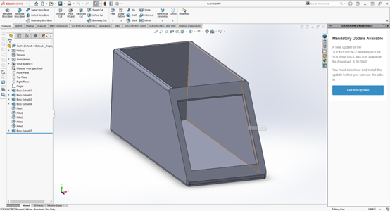
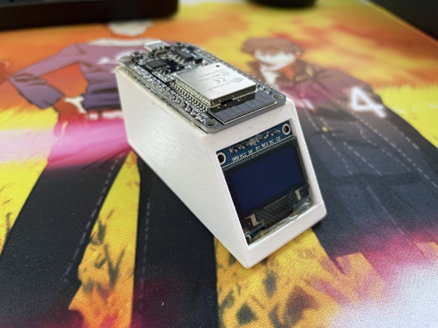
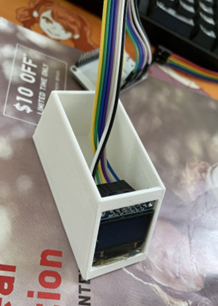

# Desktop_Weather_Clock

Desktop Weather Clock Project

### Description: 
I want to design a weather clock that I can put on my table to tell me the time and current weather, temperature and so on. So I selected the ESP32 board and SSD1306 LCD (which is in my little electronics storage so that I don’t have to spend money) for this project. 

### Material:
1.	ESP32 dev kit;
2.	SSD1306 0.96-inch LCD;
3.	3D Printed Case;

### Schematics:

### Reference Source:
For the connection of the SSD1306 in SPI communication, I found this tutorial to be very useful, and that is what I am following in this project: [here](https://www.electronicshub.org/esp32-oled-display/)

And for how to get the weather data from online source, I used the API from the Open Weather Map, which it allows any free account to query the server at 1Hz frequency, which is more than sufficient for this project. Tutorial refers to: 
[here](https://randomnerdtutorials.com/esp32-http-get-open-weather-map-thingspeak-arduino/)
and
[here](https://did321.github.io/2021/07/28/ESP32-TFT-%E5%88%86%E5%85%89%E6%A3%B1%E9%95%9C%E5%AE%9E%E7%8E%B0%E9%80%8F%E6%98%8E%E5%B0%8F%E7%94%B5%E8%A7%86/)

Besides that, to get the current time, I am using the NTP client to get the time form we source. 

### Case Design:
For a better appearance, I designed a case to enclose all wires inside. The Case is constructed in SolidWorks and sliced by Cura and then 3D printed out. The case construction file is shared in this repository as well. 

### Assembly and Result:

(Note that the horizontal black line is not visible by bare eyes)
